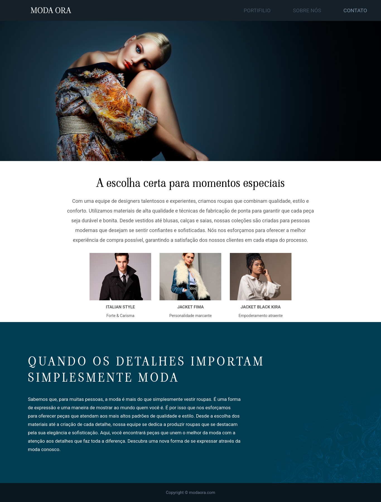

# Moda Ora

Um site elegante e moderno desenvolvido com HTML e CSS que apresenta uma coleção de moda com foco em estilo e qualidade.

## 🌟 Visão Geral

O projeto **Moda Ora** é um site de moda fictício, focado em demonstrar um design limpo e sofisticado. Ele destaca a curadoria de peças de alta qualidade, a paixão por detalhes e a importância da moda como forma de expressão.

## 🛠️ Tecnologias Utilizadas

* **HTML5:** Para a estrutura e semântica do conteúdo.
* **CSS3:** Para a estilização e layout, incluindo:
    * Variáveis CSS (`:root`) para gerenciamento de cores e fontes.
    * Flexbox para layouts dinâmicos (como o header e a seção de estilos).
    * Fontes externas do Google Fonts.
    * Imagens de fundo fixas e dimensionadas (`background-attachment: fixed`, `background-size: cover`).

## ✨ Imagem do Site

